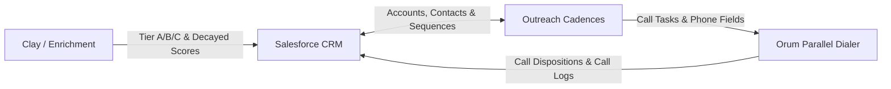

# Core Stack Data Flow & Sync Architecture

This document defines the bi-directional data flow, field mappings, and compliance sync logic between **Salesforce**, **Outreach**, **Orum**, and **Clay**.

---

## 1. System Architecture Overview

---

## 2. Field Specifications & Standardized Schema

| Salesforce API Name | Outreach Field | Orum Mapping | Sync Direction | Notes |
| :--- | :--- | :--- | :--- | :--- |
| `Account_Tier__c` | `Account Tier` | Custom Field | Salesforce -> Outreach -> Orum | Options: `Tier A`, `Tier B`, `Tier C` |
| `Signal_Score_Decayed__c` | `Signal Score` | Priority Weight | Salesforce -> Outreach -> Orum | Numeric (0–100) computed by Python decay model |
| `Outbound_Disqualification_Reason__c` | `Disqualification Reason` | Disposition Mapping | Orum -> Salesforce | Picklist options aligned with `glossary.md` |
| `HasOptedOutOfEmail` | `Email Opt-Out` | N/A | Bidirectional | Email opt-out **ONLY** |
| `DoNotCall` | `Do Not Call` | DNC Status | Bidirectional | Blocks Orum phone tasks **ONLY** |

---

## 3. Compliance & Loop Prevention Rules

### A. Strict Opt-Out Uncoupling Rule
* **Email Unsubscribe (`HasOptedOutOfEmail = True`):** Automatically pauses active Outreach email cadences. **It does NOT set `DoNotCall = True`.** BDRs remain compliant to call prospects over the phone via Orum unless explicit phone opt-out is requested.
* **Phone DNC (`DoNotCall = True`):** Flags contact as DNC in Orum and removes phone dial tasks.

### B. Bi-Directional Sync Loop Prevention
* **System of Record Ownership:** Salesforce is the master record for Account/Contact creation and Opportunity stage updates.
* **Call Dispositions:** Orum logs call notes and dispositions directly to Salesforce tasks, which asynchronously update Outreach activity metrics via standard integration triggers.
