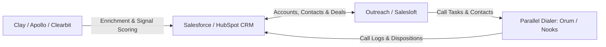

# GTM Stack Data Flow & Sync Architecture

An operational map detailing bidirectional data flows, object mappings, automation triggers, and field synchronization across core revenue technology systems.

---

## 1. System Integration Topology

```
┌─────────────────┐       Bidirectional Sync      ┌─────────────────┐
│                 ├──────────────────────────────►│                 │
│  Salesforce /   │   Accounts, Contacts, Deals   │  Outreach /     │
│  HubSpot CRM    │◄──────────────────────────────┤  Salesloft      │
│                 │   Activities, Sequence Status │                 │
└────────┬────────┘                               └────────┬────────┘
         │                                                 │
         │ Enrichment Sync                                 │ Call Tasks / Logs
         ▼                                                 ▼
┌─────────────────┐                               ┌─────────────────┐
│ Clay / Apollo / │                               │ Parallel Dialer │
│ Clearbit        │                               │ (Orum / Nooks)  │
└─────────────────┘                               └─────────────────┘
```

---

## 2. Core Bidirectional Sync Rules

### A. CRM <-> Engagement Engine (Salesforce / Outreach)

| Source System | Destination System | Trigger / Event | Object Mapping | Sync Direction | Field Mapping / Payload |
| :--- | :--- | :--- | :--- | :--- | :--- |
| **Outreach** | CRM | Sequence Step Completed | Activity / Task | Outbound | Subject, Call Notes, Sentiment, Duration, Sequence Name, Step # |
| **Outreach** | CRM | Prospect Replied | Contact / Lead | Outbound | `Lead_Status` -> "Working - Engaged", `Last_Activity_Date` |
| **Outreach** | CRM | Opt-Out / Unsubscribe | Contact / Lead | Outbound | `HasOptedOutOfEmail` = True, `DoNotCall` = True |
| **CRM** | Outreach | Lead Assigned to BDR | Prospect | Inbound | `OwnerId`, `Email`, `Phone`, `Title`, `Account_Tier` |
| **CRM** | Outreach | Opportunity Created | Prospect | Inbound | Mark Prospect as "Finished (Converted)", remove from active sequences |

---

### B. Parallel Dialer <-> Engagement Engine (Orum / Outreach)

| Source System | Destination System | Trigger / Event | Action Taken | Sync Mechanics |
| :--- | :--- | :--- | :--- | :--- |
| **Outreach** | Dialer | BDR enters Call Task Block | Imports call tasks from active sequence steps | API Fetch on user login |
| **Dialer** | Outreach | Connect / Conversation | Logs call task, advances step, tags call disposition | Real-time Webhook / API write-back |
| **Dialer** | Outreach | Bad Number / Disconnected | Updates phone status, tags step as invalid | Sets `Phone_Status__c` = "Invalid" |
| **Dialer** | CRM | Call Disposition = "Meeting Booked" | Creates CRM Task & updates Lead/Contact stage | Direct CRM Write via OAuth connection |

---

## 3. Custom Field & Relationship Specification

### Custom Account & Contact Fields

* **`GTM_Account_Tier__c`** *(Picklist: Tier 1, Tier 2, Tier 3)*: Derived from `score_accounts.py`.
* **`Signal_Score_Decayed__c`** *(Number)*: Updated via time-decay pipeline run (`decay_calculator.py`).
* **`Sequence_Active_Name__c`** *(Text)*: Name of active Outreach sequence to prevent duplicate enrolment.
* **`Outbound_Disqualification_Reason__c`** *(Picklist)*: Standardized taxonomy (e.g., *Competitor Contracted*, *No Budget*, *Wrong Persona*, *Unresponsive*).

---

## 4. Automation Guardrails & Conflict Resolution

1. **System of Record Ownership:**
   * **CRM** owns Account Tiering, Deal Ownership, and Do-Not-Contact global statuses.
   * **Engagement Platform** owns active sequence state, step history, and execution schedules.
2. **Deduplication Logic:**
   * Unique identifier key: `Email` (Contacts) or `Domain` (Accounts).
   * Webhook payloads match on `Email` first; if unmapped, creates a new Lead/Contact under the matching Account Domain.
3. **Loop Prevention:**
   * Automated updates written by API service accounts bypass outward-bound triggers (e.g., updating `Last_Activity_Date` via Outreach API does not trigger CRM outbound webhooks back to Outreach).

---

## 5. Visual Data Flow (Mermaid Diagram)


