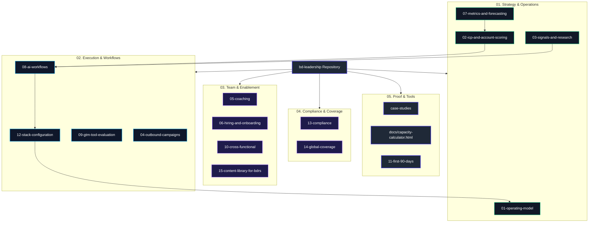

# GTM & Business Development Leadership Framework

An enterprise-grade blueprint, execution framework, and programmatic toolset for scaling outbound Go-To-Market (GTM) teams, account scoring, AI automation pipelines, and revenue operations.

---

## Repository Architecture & Navigation



---

## Quick Start Commands

```bash
# 1. Install dependencies
pip install -r requirements.txt

# 2. Score target accounts using fit & signal weights
python 01-strategy-and-operations/02-icp-and-account-scoring/score_accounts.py sample-data/accounts.csv

# 3. Validate conversion lift against historical datasets
python 01-strategy-and-operations/02-icp-and-account-scoring/backtest.py sample-data/historical.csv

# 4. Generate AI account brief & personalized hooks (dry-run mode)
python 02-execution-and-workflows/08-ai-workflows/pipeline.py build sample-data/accounts.csv sample-data/contacts.csv

# 5. Process human-approved briefs into sequence execution payloads
python 02-execution-and-workflows/08-ai-workflows/pipeline.py enroll approval_queue.csv
```
