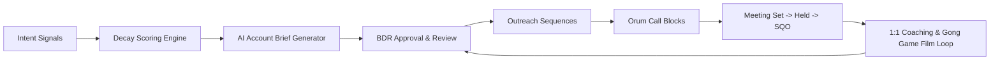

# Outbound BDR Leadership & GTM Execution Operating System


> **How I build, coach, and scale outbound BDR teams — backed by hands-on sales development, structured coaching cadences, and automated AI workflows for scoring, research, and sequencing.**

---

## 👤 Who I Am & Leadership Philosophy

I am a Business Development Leader with a proven track record of scaling outbound sales development teams, developing top-tier BDR talent, and building repeatable pipeline engines.

My leadership approach balances **people-first coaching** with **operational discipline**:
* **Hands-on Coaching:** Regular 1:1 call coaching, live phone block shadowing, and role-play frameworks that build rep confidence and skill.
* **Pipeline Accountability:** Rigorous execution focused on high-conversion metrics: Meeting Set -> Meeting Held -> Sales Qualified Opportunity (SQO).
* **Modern Tooling as Leverage:** Building AI research tools and signal-scoring calculators to eliminate manual rep admin work so BDRs spend more time having high-value prospect conversations.

---

## 🚀 Start Here: Core Operating Systems

| Focus Area | Key Deliverables & Playbooks | Description |
| :-- | :-- | :-- |
| **1. People & Coaching** | [Coaching Scorecards & Frameworks](./03-team-and-enablement/05-coaching/)<br>[Retention & Team Health](./03-team-and-enablement/06-hiring-and-onboarding/retention-and-team-health.md) | Structured 1:1 call review scorecards, onboarding ramps, and rep development plans. |
| **2. Metrics & Strategy** | [First 90 Days Plan](./05-proof-and-tools/11-first-90-days/role-tailored-execution-plan.md)<br>[Unit Economics & Capacity Math](./01-strategy-and-operations/07-metrics-and-forecasting/unit-economics.md)<br>[System Glossary](./01-strategy-and-operations/glossary.md) | Leadership blueprint for Month 1 phone blocks, team diagnostics, capacity models, and terminology source of truth. |
| **3. AI Systems & Automation** | [Intent Signal Decay Calculator](./01-strategy-and-operations/03-signals-and-research/decay_calculator.py)<br>[Account Research & Brief Pipeline](./02-execution-and-workflows/08-ai-workflows/pipeline.py)<br>[Sync Architecture Spec](./02-execution-and-workflows/12-stack-configuration/sync-architecture.md) | Runnable Python engines for signal time-decay math, LLM account research briefs, and CRM sync rules. |

---

## 🏗️ End-to-End Outbound Workflow Architecture



---

## 🛠️ Runnable Tooling & Local Quickstart

### 1. Run the Signal Time-Decay Calculator
Computes time-decayed weights for buyer intent signals:
```bash
python3 01-strategy-and-operations/03-signals-and-research/decay_calculator.py
```

### 2. Run the Account Scoring Engine
Scores target accounts against ICP criteria:
```bash
python3 01-strategy-and-operations/02-icp-and-account-scoring/score_accounts.py
```

### 3. Run Automated Tests & Prompt Evals
```bash
pytest
```

---

## 🧠 GTM Prompt & Agent Library

15 curated prompt agents + 5 shared sub-agents + 3 bounded-autonomy Workflow Contracts, scoped to inbound/outbound SDR leadership specifically (pulled from a broader 53-agent library and filtered down -- no AE/CS/RevOps-engineering material here).

- [`gtm-prompt-library/agents/`](gtm-prompt-library/agents/) -- speed-to-lead SLA enforcement, inbound qualification, sequencing, objection handling, CASL compliance, and more
- [`gtm-prompt-library/sub-agents/`](gtm-prompt-library/sub-agents/) -- ICP fit scoring, trigger-event detection, consent checking, objection mapping, competitive intel lookup
- [`gtm-prompt-library/contracts/`](gtm-prompt-library/contracts/) -- `speed-to-lead-sla`, `inbound-lead-qualifier`, `casl-compliance-gate`
- [`02-execution-and-workflows/08-ai-workflows/speed-to-lead-README.md`](02-execution-and-workflows/08-ai-workflows/speed-to-lead-README.md) -- a working (proof-of-concept) MCP server implementing the speed-to-lead SLA contract

---

## 📁 Repository Structure

* `01-strategy-and-operations/` — Account scoring models, intent signal calculators, capacity math, and system glossary.
* `02-execution-and-workflows/` — AI research pipelines, sequence designs, and Salesforce / Outreach / Orum sync specs.
* `03-team-and-enablement/` — Coaching scorecards, call evaluation rubrics, BDR ramps, and content enablement.
* `04-compliance-and-coverage/` — Deliverability guardrails, CAN-SPAM/CASL compliance, and timezone routing models.
* `05-proof-and-tools/` — First 90 Days leadership blueprint, case studies, and interactive capacity calculators.
